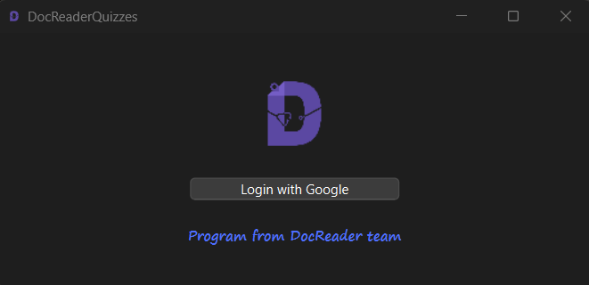
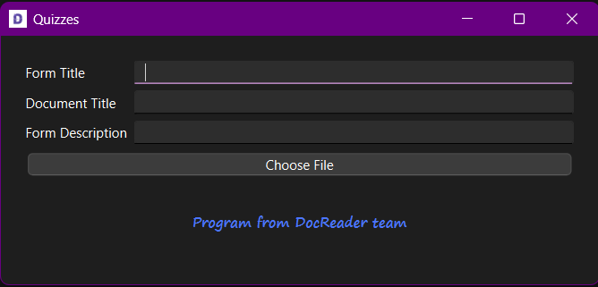

# DocReaderQuizzes Quiz Generator

A simple application that converts a text file into a Google Forms quiz.

## Table of Contents
- [About The Project](#about-the-project)
- [Getting Started](#getting-started.
- [Usage](#usage.
- [Text File Specification/Format](#text-file-specification)
- [Roadmap](#roadmap)
- [License](#license.
- [Third-party Libraries](#third-party-libraries)

## About The Project

This project allows users to create quizzes from a text file formatted in a specific way. It automates the process of generating questions and answers for Google Forms.

## Getting Started

To get a local copy up and running follow these simple steps.

### Dependencies

- Qt 6.8.x (dynamically-linked.

### Installation

#### For Developers
You can fork the repo or you can clone it. Then you can build it locally and modify it as you like.

#### For end users
Install the built app from the [releases page](https://github.com/M0ST4FA/DocReaderQuizzes/releases). 

> [!NOTE]
> Choose the latest version, since it will have the latest fixes and features. 

> [!IMPORTANT]
> Be sure to choose the build that matches your OS. Otherwise, the app will not work on your machine.

## Usage

1. Open Quizzes.exe
2. When you open it for the first time, you will be directed to the authentication page. 

  - Press ```Login with Google``` button. This will direct you to the familiar Google authentication page.
  - Your credentials will be saved locally (we don't save any sensitive information on any server, only on your computer for convenience purposes) so that you don't have to re-authenticate the next times you open the app.
3. After you authenticate, you will be directed to the main page.

  - In this page:
    1. Enter the title of the form.
    2. Enter the title of the document in your Google Drive.
    3. Enter a description of the form.
    4. Click ```Choose File```. This will open up a file dialog. Choose the file from which the form will be generated.
    5. Click ```Create Form```. The form will be created in your Google Drive and the name of the document will be the name you entered in the ```Document Title``` field above.

## Text File Specification

#### Format
- The text file consists of a list of questions.

- Each question consists of:
  1. Question title
  2. Options

- Each question title consist of:
  1. Question indicator, which is a numeral followed by "."
  2. Question text, which can span multiple lines.

- Each option consists of:
  1. (optional) Correct answer indicator, which is "*", and indicates a correct answer. There must be one, and only one correct answer. Otherwise, behavior is undefined. This behavior is not enforced by the parser.
  2. Option indicator, which is a sequence of one or more letters followed by "."
  3. Option text, which **cannot** span multiple lines.

#### Example of Text File

``` text
1. What is the outer layer 
of the heart?
	* a. Epicardium
	b. Pericardium
	c. Endocardium
	d. Tunica intima
2. The value of the GFR is about:
  a. 150 ml/min
  *b. 125 ml/min
  c. 400 ml/min
  d. 500 ml/min
```
Notice how  the first question spans multiple lines. Also notice that you can indent options for ease of reading. The correct answer is indicated by "*" preceding the option indicator.

## Roadmap

- [ ] Support additional quiz specifications (e.g., TOML and YAML)
- [ ] Support generating quizzes from pdf directly (you can do it now with copy-and-paste, assuming correct format)
- [ ] Support generating quizzes from image directly (you can do it now with copy-and-paste and the help of Google lens, assuming correct format)

## License

See [LICENSE](LICENSE. for more information.

## Third-party Libraries

This application uses the following third-party libraries:

- **Qt Libraries**: Licensed under the GNU Lesser General Public License (LGPL).
  - Source code available at: https://github.com/qt/qtbase
  - Full text of LGPL license: https://www.gnu.org/licenses/lgpl-3.0.txt
